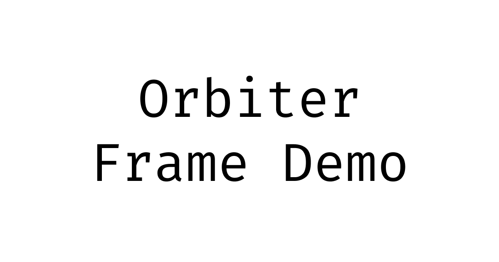

## Orbiter V2 Frame Demo



This is a simple Farcaster V2 Frame built with React + Vite that can be hosted on IPFS and Base through [Orbiter](https://orbiter.host).

> [!TIP]
> [Read the tutorial on how to build this frame!](https://orbiter.host/blog/how-to-deploy-a-v2-frame-on-orbiter)

## Setup

Clone the repo and install dependencies

```bash
git clone https://github.com/orbiterhost/v2frame
cd v2frame
npm install
```

Make a build of the site to initially deploy

```bash
npm run build
```

Make an account on [Orbiter](https://app.orbiter.host) and upload the `dist` folder as a new site, or use the [orbiter-cli](https://github.com/orbiterhost/orbiter-cli) to programmatically create the site.

```bash
npm i -g orbiter-cli

orbiter login -p google # or github

orbiter create -d <choose a name> ./dist
```

Take note of the full domain of your new website!

## Development

Run the development server. If you plan to test inside the [Frame Developer Tools](https://warpcast.com/~/developers/frames) be sure to tunnel through a service like Ngrok or Tailscale

```bash
npm run dev
```

[Follow the tutorial to see steps on updating the Frame Manifest and Embed Tag](https://orbiter.host/blog/how-to-deploy-a-v2-frame-on-orbiter)

When completed make a new build of the site using `npm run build` and update your Orbiter site on the app or with the CLI:

```bash
orbiter update -d <your name> ./dist
```

## Contact

Feel free to [reach out](mailto:steve@orbiter.host,justin@orbiter.host) if you have any questions!
